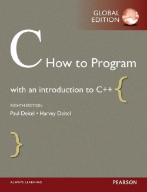

# C How to Program Exercise Solutions

This repository holds solutions for exercises found in the book C How to Program.

## Table of Contents

[About the Book](#about-the-book)  
[About the Exercise Solutions](#about-the-exercise-solutions)  
[Chapter 1 Exercise Solutions](#chapter-1-exercise-solutions)  
[Chapter 2 Exercise Solutions](#chapter-2-exercise-solutions)  

## About the Book

The book is written by Paul Deitel and Harvey Deitel and have been published in multiple different editions. The content in this repository is based on the following edition:

Title: C How to Program, Global edition, 8th Edition  
Publisher: Pearson  
Publication year: 2016  
ISBN-13: 978-1-292-11097-4  

## About the Exercise Solutions

The book includes exercises and this repository holds solutions to some of these. The solutions are written by ordinary readers of the book and not associated with the book authors or the publisher.

The end goal is to have a complete set of high quality solutions.

## Chapter 1 Exercise Solutions

## Chapter 2 Exercise Solutions
